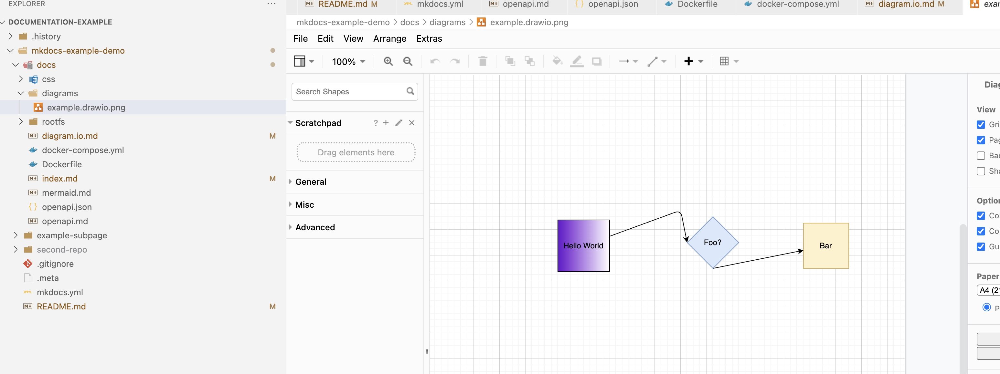

# Diagramming

Edit in vscode and see real time updates in your documentation!
## Prerequisite
- Download vscode
- install the extension **Draw.io Integration**
- modify the example.drawio.png in Visual Code editor, save and see this page refresh

**Screenshot of Vscode editing:**

[Back Home](/#using-diagramio-for-diagrams)
