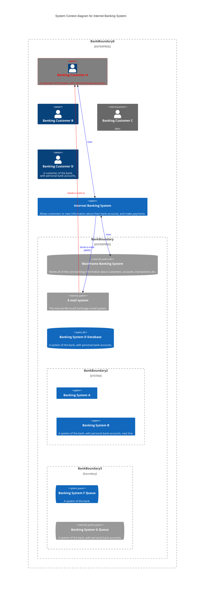
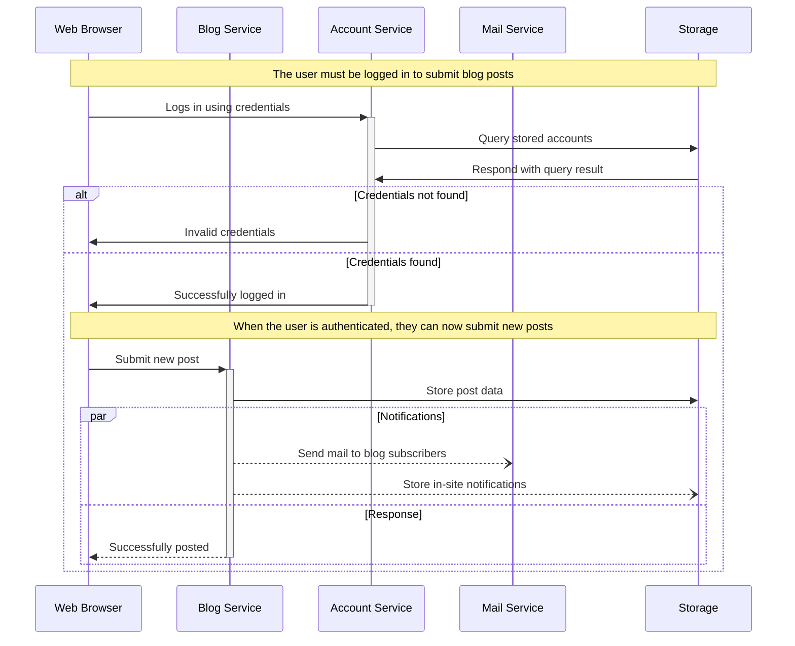

# Diagramming with Mermaid

Use code to document diagrams, flows, charts and more! 
## Prerequisite

- Installed VSCode editor
- Install extension [>click here](https://marketplace.visualstudio.com/items?itemName=bierner.markdown-mermaid)
- Read Mermaid docs [>click here](https://mermaid-js.github.io/mermaid/#/)
- Review the mermaid.md file in this repository for examples:

## C4 Model example

## Sequence example

[Back Home](/#using-diagramio-for-diagrams)